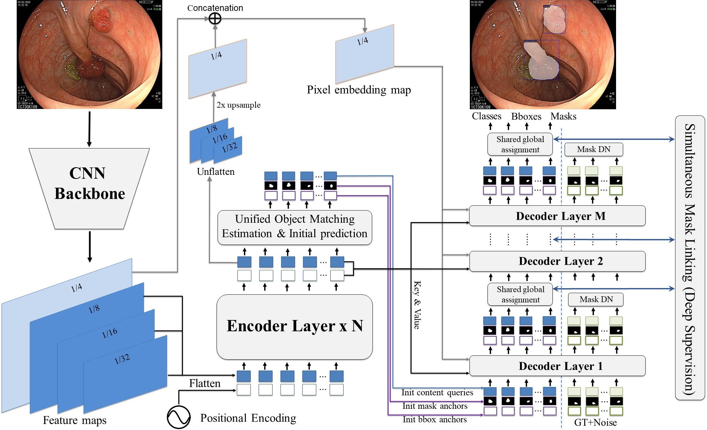
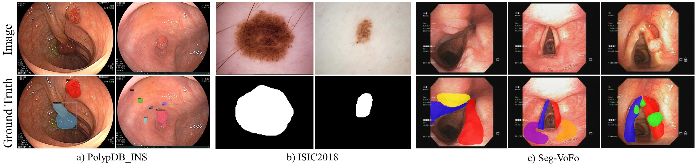

# SiMaskFormer

**SiMaskFormer: Simultaneous Mask Linking and Adaptive Refinement for Universal Medical Image Segmentation**

##  Introduction

This repository contains the PyTorch implementation of SiMaskFormer, a universal transformer-based segmentation model designed for universal medical image segmentation. SiMaskFormer integrates three key innovations to enhance accuracy and consistency across segmentation tasks. First, the **Unified Object Matching Estimation** mechanism learns to predict query-to-object alignment costs by jointly considering classification, bounding box, and mask quality, replacing conventional classification confidence used for query selection. **Adaptive Mask Refinement** module iteratively improves segmentation quality by leveraging boundary-aware positional encoding to guide attention more effectively by providing clearer positional cues for regions containing objects. Finally, **Simultaneous Mask Linking** enforces a single global query-to-object assignment shared across all decoder layers, ensuring consistent supervision for classification, box regression, and mask prediction throughout the decoding process.



##  Install dependencies

Dependent libraries
* torch
* torchvision 
* opencv
* ninja
* fvcore
* iopath
* antlr4-python3-runtime==4.9.2

Install detectron2 and SiMaskFormer

```bask
# Under your working directory
# Install Detectron2
cd /detectron2
python setup.py build develop


#Install requirements for SiMaskFormer
cd /simaskformer
pip install -r requirements.txt

cd /simaskformer/simaskformer/modeling/pixel_decoder/ops
sh make.sh
```

##  Datasets
SiMaskFormer is valuated on three medical imaging datasets covering both instance and semantic segmentation tasks. PolypDB_INS is a endoscopic polyp dataset designed for instance segmentation, containing diverse cases of sessile and pedunculated polyps, with corresponding binary masks enabling semantic evaluation. ISIC2018 is a public dermoscopic image benchmark for binary semantic segmentation of skin lesions, supporting rigorous assessment in melanoma detection. Seg-VoFo is a private laryngoscopic dataset for multi-class semantic segmentation of laryngeal structures and lesions, annotated into six anatomical and pathological categories. 


Examples of annotations from (a) PolypDB_INS instance segmentation, (b) ISIC2018 binary lesion segmentation, and (c) Seg-VoFo multi-class segmentation including left vocal fold (blue), right vocal fold (red), left arytenoid cartilage (purple), right arytenoid cartilage (orange), benign lesion (yellow), and malignant lesion (green).

- The PolypDB_INS is avaiable at [download link](<https://drive.google.com/file/d/1olTs9hZA4o81vfrYO32oZVuGzvTVNIQ_/view?usp=sharing>)
- The ISIC2018 is avaiable at [download link](<https://challenge.isic-archive.com/data/#2018>)
- The private Seg-VoFo dataset is used in accordance with the Declaration of Helsinki, with ethical approval granted by the Independent Ethics Committee of Cho Ray Hospital (No. 1280/GCN-HÐÐÐ, 9 March 2020)


##  Usage - Polyp Instance Segmentation

####  1. Training

```bash
python ./simaskformer/train_net.py --config-file $config_file --num-gpus 1 --resume DATASETS.TRAIN '("polypdb_ins_train",)' DATASETS.TEST '("polypdb_ins_val",)' DATALOADER.NUM_WORKERS 8  SOLVER.IMS_PER_BATCH 8 SOLVER.BASE_LR 0.0001 SOLVER.STEPS "(19815,26420)" SOLVER.MAX_ITER 29722 SOLVER.CHECKPOINT_PERIOD 330 TEST.EVAL_PERIOD 330 TEST.EVAL_START_ITER 0 OUTPUT_DIR $output_dir
```
* $config_file: the path to the config file, polyp instance segmentation(./simaskformer/configs/polypdb_ins/instance-segmentation/simaskformer_R50_bs8.yaml).
* $output_dir: specify the path to save the checkpoint of model during the training process.

####  2. Inference

```bash
python ./simaskformer/train_net.py --config-file $config_file --num-gpus 1 --eval-only  DATASETS.TEST '("polypdb_ins_test",)' DATALOADER.NUM_WORKERS 1  SOLVER.IMS_PER_BATCH 1 MODEL.WEIGHTS $checkpoint OUTPUT_DIR $output_dir
```
* $config_file: the path to the config file, polyp instance segmentation(./simaskformer/configs/polypdb_ins/instance-segmentation/simaskformer_R50_bs8.yaml).
* $output_dir: specify the path to save the results during the evaluating process.
* $checkpoint: path to the trained checkpoint of model.


##  Usage - Polyp Semantic Segmentation

####  1. Training

```bash
python ./simaskformer/train_net.py --config-file $config_file --num-gpus 1 --resume DATASETS.TRAIN '("polypdb_ins_sem_seg_train")' DATASETS.TEST '("polypdb_ins_sem_seg_val",)' DATALOADER.NUM_WORKERS 8  SOLVER.IMS_PER_BATCH 16 SOLVER.BASE_LR 0.0001 SOLVER.STEPS "(9907,13210)" SOLVER.MAX_ITER 14862 SOLVER.CHECKPOINT_PERIOD 165 TEST.EVAL_PERIOD 165 TEST.EVAL_START_ITER 0 OUTPUT_DIR $output_dir
```
* $config_file: the path to the config file, polyp semantic segmentation(./simaskformer/configs/polypdb_ins/semantic-segmentation/simaskformer_R50_bs16_steplr.yaml).
* $output_dir: specify the path to save the checkpoint during the training process.

####  2. Inference

```bash
python "./simaskformer/train_net.py" --config-file $config_file --num-gpus 1 --eval-only  DATASETS.TEST '("polypdb_ins_sem_seg_test",)' DATALOADER.NUM_WORKERS 1  SOLVER.IMS_PER_BATCH 1 MODEL.WEIGHTS $checkpoint OUTPUT_DIR "$output_dir"
```
* $config_file: the path to the config file, polyp semantic segmentation(./simaskformer/configs/polypdb_ins/semantic-segmentation/simaskformer_R50_bs16_steplr.yaml).
* $output_dir: specify the path to save the results during the evaluating process.
* $checkpoint: path to the trained checkpoint of model.


##  Usage - Skin Lesion Semantic Segmentation

####  1. Training

```bash
python ./simaskformer/train_net.py --config-file $config_file --num-gpus 1 --resume DATASETS.TRAIN '("isic_sem_seg_train")' DATASETS.TEST '("isic_sem_seg_val",)' DATALOADER.NUM_WORKERS 8  SOLVER.IMS_PER_BATCH 16 SOLVER.BASE_LR 0.0001 SOLVER.STEPS "(9727,12970)" SOLVER.MAX_ITER 14592 SOLVER.CHECKPOINT_PERIOD 162 TEST.EVAL_PERIOD 162 TEST.EVAL_START_ITER 0 OUTPUT_DIR $output_dir
```
* $config_file: the path to the config file, skin lesion semantic segmentation(./simaskformer/configs/isic2018/semantic-segmentation/simaskformer_R50_bs16_steplr.yaml).
* $output_dir: specify the path to save the checkpoint during the training process.

####  2. Inference

```bash
python "./simaskformer/train_net.py" --config-file $config_file --num-gpus 1 --eval-only  DATASETS.TEST '("isic_sem_seg_test",)' DATALOADER.NUM_WORKERS 1  SOLVER.IMS_PER_BATCH 1 MODEL.WEIGHTS $checkpoint OUTPUT_DIR "$output_dir"
```
* $config_file: the path to the config file, polyp semantic segmentation(./simaskformer/configs/isic2018/semantic-segmentation/simaskformer_R50_bs16_steplr.yaml).
* $output_dir: specify the path to save the results during the evaluating process.
* $checkpoint: path to the trained checkpoint of model.
  


##  Acknowledgement

Part of the code was adpated from [Mask DINO: Towards A Unified Transformer-based Framework for Object Detection and Segmentation](<https://github.com/IDEA-Research/MaskDINO>)

```bash
@INPROCEEDINGS {10204168,
author = { Li, Feng and Zhang, Hao and Xu, Huaizhe and Liu, Shilong and Zhang, Lei and Ni, Lionel M. and Shum, Heung-Yeung },
booktitle = { 2023 IEEE/CVF Conference on Computer Vision and Pattern Recognition (CVPR) },
title = {{ Mask DINO: Towards A Unified Transformer-based Framework for Object Detection and Segmentation }},
year = {2023},
volume = {},
ISSN = {},
pages = {3041-3050},
keywords = {Training;Visualization;Semantic segmentation;Machine vision;Semantics;Noise reduction;Object detection},
doi = {10.1109/CVPR52729.2023.00297},
url = {https://doi.ieeecomputersociety.org/10.1109/CVPR52729.2023.00297},
publisher = {IEEE Computer Society},
address = {Los Alamitos, CA, USA},
month =Jun
}
```

